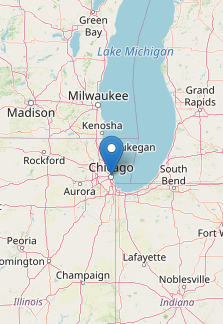

# Controlling hallucinations {#sec-hallucinations}

When it comes to reliability, the components in and around agents have different strengths and weaknesses.

Component | Strengths | Weaknesses
---|---|---
LLM | Proposing ideas, translating human intent into tool inputs. | LLMs hallucinate, and their outputs must be verified by humans.
Tools | Trustworthy and testable. Outputs are reliable given correct inputs. | Limited flexibility, inputs need verification.
User | Setting goals, framing intent, checking tool inputs. | Slow, fatigues easily, cannot reliably check tool outputs.

To control hallucinations, we leverage these strengths and compensate for the weaknesses.
This chapter builds the intuition for how to do that, and formalizes it into the set of rules that define trusted mini-agents.

## Agents are vulnerable to hallucinations.

> "All models are wrong, but some are useful."
>
> — @box1987

REMEMBER: An LLM is a model with less-than-perfect prediction accuracy.
At any time for any reason, an LLM can produce a [hallucination](https://en.wikipedia.org/wiki/Hallucination_(artificial_intelligence)): a confident-sounding prediction that is completely wrong.
Prompt engineering and [skill creation](https://agentskills.io) can never eliminate hallucinations entirely.
The choice of prompt and model improves convenience, but it cannot guarantee correctness.

::: {.callout-tip}
Prompts, skills, and models are about *convenience*, not correctness.
:::

For example, consider a simple weather agent.^[
  The [documentation of `ellmer`](https://ellmer.tidyverse.org/articles/tool-calling.html#introduction) cautions against this sequence diagram because it draws a direct arrow from the LLM to the tool.
  As the [`ellmer`](https://ellmer.tidyverse.org) authors rightly emphasize, the LLM does not actually run the tool: it only proposes an unevaluated tool call.
  However, our diagram is different because we think of the arrow as part of the harness (see the [previous chapter](agents.qmd#sec-workflow)).
  We do not imply that LLMs run tools.
  We only imply that the harness delivers the call from the LLM to the tool.
  This simplified framing helps us build trusted mini-agents.
]
The agent has a single `get_weather()` tool, which scrapes the National Weather Service (NWS) API for real weather data.
The agent elicits a location from the user, calls `get_weather()` to get the weather at that location, returns the result to the LLM, and relays the LLM's response back to the user.
Even though `get_weather()` gives the agent access to reliable data, hallucinations can still happen through the LLM.

::: {#fig-weather-vulnerable}

```{mermaid}
%%{init: {'theme':'base', 'themeVariables': {'actorBkg':'#1F3A63','actorTextColor':'#ffffff','actorBorder':'#1F3A63','noteBkgColor':'#F3F4F6','noteBorderColor':'#9CA3AF','noteTextColor':'#1F2937'}}}%%
sequenceDiagram
    participant User
    participant LLM
    participant Tool

    User->>LLM: What's the weather in Chicago?
    rect rgba(220, 38, 38, 0.25)
    LLM->>Tool: get_weather(lat = 41.8, long = -87.6)
    note over LLM,Tool: Vulnerable (AI-generated coordinates)
    end
    Tool->>LLM: {"temperature": 72, "weather": "Sunny"}
    rect rgba(220, 38, 38, 0.25)
    LLM->>User: It's 50°F and rainy in Indianapolis.
    note over User,LLM: Hallucination (wrong city)
    end
```

Sequence diagram of the weather agent's vulnerabilities. The LLM generates the coordinates for `get_weather()` unchecked, and even though the tool returns correct data for Chicago, the LLM can still hallucinate when relaying the result, reporting the wrong city to the user.
:::

::: {.callout-tip}
As explained in the [previous chapter](agents.qmd#sec-workflow), we interpret the arrows in the diagram as part of the harness.
The arrow labeled "get_weather(lat = 41.8, long = -87.6)" shows how the harness delivers the LLM-generated tool call to the tool itself.
(The harness, not the LLM, actually runs tools.)
As we will see below, designing a trusted mini-agent is all about drawing the best arrows.
:::

## How to fix the weather agent

To control hallucinations in the weather agent, we do not try to improve our system prompt or choose a "better" LLM.
That would be wishful thinking.
Instead, we identify precisely where hallucinations can happen, and we engineer the [harness](https://www.langchain.com/blog/the-anatomy-of-an-agent-harness) to eliminate those vulnerabilities.

### Fix 1 of 3: Help the human review the location.

The AI-generated text of a tool call is a fallible LLM prediction.
To control hallucinations in tool calls, we need to build in human oversight while acknowledging the limitations of human attention and effort.
In the case of the weather agent, most human users will not bother to check the longitude and latitude numbers in "get_weather(41.8, -87.6)".
Checking the raw coordinates of every tool call is simply too inconvenient for a human.
Instead, we render an eye-catching interactive map with a pin in the location.
That way, it becomes obvious to any human user whether the LLM chose the right place.

::: {#fig-fix1 layout="[70,30]" layout-valign="center"}

```{mermaid}
%%{init: {'theme':'base', 'themeVariables': {'actorBkg':'#1F3A63','actorTextColor':'#ffffff','actorBorder':'#1F3A63','noteBkgColor':'#F3F4F6','noteBorderColor':'#9CA3AF','noteTextColor':'#1F2937'}}}%%
sequenceDiagram
    participant User
    participant LLM
    participant Tool

    User->>LLM: What's the weather in Chicago?
    rect rgba(234, 179, 8, 0.25)
    LLM->>Tool: get_weather(lat = 41.8, long = -87.6)
    note over LLM,Tool: ① Coordinates rendered as a map for review.
    end
    Tool->>LLM: {"temperature": 72, "weather": "Sunny"}
    rect rgba(220, 38, 38, 0.25)
    LLM->>User: It's 50°F and rainy in Indianapolis.
    note over User,LLM: Hallucination (wrong city)
    end
```



Sequence diagram showing Fix 1. The user asks "What's the weather in Chicago?" and an interactive map of Chicago with a pin is displayed for human review before calling get_weather(lat = 41.8, long = -87.6). The map helps the user verify the location input.
:::

### Fix 2 of 3: Bypass the LLM to report the weather.

We do not trust the LLM to describe NWS weather data, even if it's just relaying data back to the user.
Because it would require output from an LLM, even this simple task would be vulnerable to hallucinations.
However, we do trust the NWS weather data itself.
Instead of reading about the weather from the LLM, we should read it directly from the tool it comes from.
We engineer the tool to bypass the LLM and return NWS weather data straight to the user interface.

::: {#fig-fix2 layout="[70,30]" layout-valign="center"}

```{mermaid}
%%{init: {'theme':'base', 'themeVariables': {'actorBkg':'#1F3A63','actorTextColor':'#ffffff','actorBorder':'#1F3A63','noteBkgColor':'#F3F4F6','noteBorderColor':'#9CA3AF','noteTextColor':'#1F2937'}}}%%
sequenceDiagram
    participant User
    participant LLM
    participant Tool

    User->>LLM: What's the weather in Chicago?
    rect rgba(234, 179, 8, 0.25)
    LLM->>Tool: get_weather(lat = 41.8, long = -87.6)
    note over LLM,Tool: ① Coordinates rendered as a map for review.
    end
    Tool->>User: {"temperature": 72, "weather": "Sunny"}
```


Sequence diagram showing Fix 2. After the map confirms the location, `get_weather()` sends NWS weather data directly to the user interface instead of relaying it through the LLM. Bypassing the LLM for this step eliminates the risk of a hallucinated weather report.
:::

### Fix 3 of 3: Never bypass the `get_weather()` tool.

Now, if the LLM chooses to call `get_weather()`, then we can trust the weather data we see.
But what if the LLM decides to bypass `get_weather()` with a different tool?
An agent like [Claude Code](https://code.claude.com/) may have [dozens of tools](https://code.claude.com/docs/en/tools-reference), including tools to write and execute arbitrary code.
Such general-purpose tools may compete with our weather tool and create a backdoor for LLM hallucinations.
For example, if our weather agent has [Claude Code](https://code.claude.com/)'s `Write()` and `Bash()` tools, then the LLM may hallucinate code to fake the data instead of calling our trusted `get_weather()` tool.

::: {#fig-fake-weather}

```{mermaid}
%%{init: {'theme':'base', 'themeVariables': {'actorBkg':'#1F3A63','actorTextColor':'#ffffff','actorBorder':'#1F3A63','noteBkgColor':'#F3F4F6','noteBorderColor':'#9CA3AF','noteTextColor':'#1F2937'}}}%%
sequenceDiagram
    participant User
    participant LLM
    participant Tool

    User->>LLM: What's the weather in Chicago?
    rect rgba(220, 38, 38, 0.25)
    LLM->>Tool: Write("fake_weather.sh")<br>Bash("fake_weather.sh")
    note over LLM,Tool: Hallucination (bypasses get_weather())
    end
    rect rgba(220, 38, 38, 0.25)
    Tool->>User: {"temperature": -999, "weather": "Vortex"}
    note over Tool,User: Fake data
    end
```

Sequence diagram of a hallucination that bypasses `get_weather()` entirely. Instead of calling the trusted tool, the LLM writes and runs its own script to fabricate weather data, producing a result that looks legitimate but comes from an untrusted source.
:::

Trusted weather data must never come from the LLM, and it must never come from untrusted tools.
We engineer the user interface so that it only ever shows weather data from `get_weather()`.

::: {#fig-fix3 layout="[70,30]" layout-valign="center"}

```{mermaid}
%%{init: {'theme':'base', 'themeVariables': {'actorBkg':'#1F3A63','actorTextColor':'#ffffff','actorBorder':'#1F3A63','noteBkgColor':'#F3F4F6','noteBorderColor':'#9CA3AF','noteTextColor':'#1F2937'}}}%%
sequenceDiagram
    participant User
    participant LLM
    participant Tool

    User->>LLM: What's the weather in Chicago?
    rect rgba(234, 179, 8, 0.25)
    LLM->>Tool: get_weather(lat = 41.8, long = -87.6)
    note over LLM,Tool: ① Coordinates rendered as a map for review.
    end
    Tool->>User: {"temperature": 72, "weather": "Sunny"}
    rect rgba(107, 114, 128, 0.2)
    LLM--xUser: ✗ Do not trust LLM for weather data.
    end
    rect rgba(107, 114, 128, 0.2)
    LLM--xTool: ✗ No other tool can produce weather data.
    end
```


Sequence diagram showing Fix 3. After `get_weather()` sends NWS data directly to the user interface, no other tool besides `get_weather()` can produce weather data, and claims about weather data from the LLM are not trusted.
:::

## Defining trusted mini-agents

We formalize these lessons from the weather agent into a general pattern for building reliable AI systems.

::: {.callout-note icon=false appearance="simple"}
## Definition: Trusted Mini-Agent

A **trusted mini-agent** is a least-privilege AI agent that engineers out hallucinations with the following three rules:

1. **Trusted tools directly produce all results.** No result comes from the LLM. And for each type of result, there exists a tool to produce it.
2. **Each result only comes from one trusted tool.** No alternative tool can bypass the designated tool.
3. **Inputs to trusted tools have trusted human oversight.** The system presents AI-generated tool input in a form that humans can verify quickly and accurately, with minimal time and minimal fatigue.
:::

The three rules map to the three fixes we made to the weather agent.

 | Rule | Fix
---|---|---
1. Trusted tools directly produce all results. | Bypass the LLM to report the weather.
2. Each result only comes from one trusted tool. | Never bypass the `get_weather()` tool.
3. Inputs to trusted tools have trusted human oversight. | Show the location in an interactive map.

In terms of tools and results, a trusted mini-agent is a bijective function.
Rule 1 implies surjectivity: every result can be produced by at least one tool.
Rule 2 implies injectivity: each result must originate from at most one distinct unique designated tool.
Here is a mental model of bijectivity for an enhanced weather tool that also reports [emergency alerts](https://en.wikipedia.org/wiki/Emergency_Alert_System):

::: {#fig-bijective}

$$
\Large f: X \mapsto Y
$$

```{mermaid}
%%| fig-width: 7.5
%%| fig-align: center
%%{init: {'theme':'base', 'themeVariables': {'lineColor':'#1F3A63','edgeLabelBackground':'#ffffff','fontSize':'18px'}}}%%
flowchart LR
    subgraph X["X: tools"]
        direction TB
        gw["get_weather()"]
        gn["get_emergency_alerts()"]
    end
    subgraph Y["Y: types of results"]
        wd["Weather data"]
        nd["Emergency alert data"]
    end
    gw --> wd
    gn --> nd

    style gw fill:#1F3A63,color:#ffffff,stroke:#1F3A63
    style gn fill:#1F3A63,color:#ffffff,stroke:#1F3A63
    style wd fill:#1F3A63,color:#ffffff,stroke:#1F3A63
    style nd fill:#1F3A63,color:#ffffff,stroke:#1F3A63
    style X fill:#DCEAF7,stroke:#9CA3AF,color:#1F3A63
    style Y fill:#DCEAF7,stroke:#9CA3AF,color:#1F3A63
```

Diagram illustrating a bijective function $f$ from $X$ to $Y$. The set $X$ (tools) contains `get_weather()` and `get_emergency_alerts()`; the set $Y$ (types of results) contains Weather data and Emergency alert data. Each tool maps to exactly one type of result, and each type of result is produced by exactly one tool, illustrating Rules 1 and 2 of a trusted mini-agent.
:::

Bijectivity is key: it ensures that final results are trusted as long as the tools and their inputs are trusted.
Tools are easy to test with [expectation-based unit tests](https://testthat.r-lib.org).
Inputs to those tools are harder to check because they depend on user oversight, but verifying inputs is usually much easier than verifying outputs.

## Impact on users

Instead of:

> Are these results correct?

users ask:

> Is the agent solving the right problem?

which is much easier to verify.

## The trusted mini-agent workflow

The trusted mini-agent workflow combines the power of modern agents with the safeguards of traditional software engineering:

::: {#fig-workflow}

```{mermaid}
%%{init: {'theme':'base', 'themeVariables': {'lineColor':'#4B5563','edgeLabelBackground':'#ffffff'}}}%%
flowchart LR
    subgraph AgentLoop["Agent Loop"]
        direction TB
        LLM["LLM"]
        UT["Untrusted<br>Tools"]
        LLM -->|"Autonomous<br>reasoning"| UT
        UT --> LLM
    end

    HR["Human<br>Review"]

    subgraph Trust["Trust"]
        direction TB
        TT["Trusted<br>Tools"]
        TR["Trusted<br>Results"]
        TT -->|"Nontrivial<br>Computation"| TR
    end

    AgentLoop -->|"Proposed Inputs"| HR
    HR -->|"Rejected Proposals"| AgentLoop
    HR -->|"Reviewed Inputs"| TT

    style LLM fill:#1F3A63,color:#ffffff,stroke:#1F3A63
    style UT fill:#6B2020,color:#ffffff,stroke:#6B2020
    style HR fill:#166534,color:#ffffff,stroke:#166534
    style TT fill:#166534,color:#ffffff,stroke:#166534
    style TR fill:#166534,color:#ffffff,stroke:#166534
    style AgentLoop fill:#FDE8E8,stroke:#9CA3AF
    style Trust fill:#F3F4F6,stroke:#9CA3AF
```

Flow diagram of a trusted mini-agent. On the left, an "Agent Loop" box contains the LLM and Untrusted Tools connected by bidirectional arrows labeled "Autonomous reasoning." The agent loop sends "Proposed Inputs" to a "Human Review" checkpoint, which can return "Rejected Proposals" back to the loop. After review, "Reviewed Inputs" flow into "Trusted Tools" inside the "Trust" boundary, which perform "Nontrivial Computation" and produce "Trusted Results" below.
:::

After an initial prompt, the work begins with the [agent loop](https://code.claude.com/docs/en/agent-sdk/agent-loop).
Here, the LLM ponders and delibererates uninterrupted and unsupervised, potentially with the aid of untrusted tools (e.g. web search, back-of-the-envelope calculations, etc.) which are structurally incapable of producing final results.

Ultimately, the LLM proposes inputs to one or more trusted tools that perform critical computations such as modeling and simulation.
Those inputs reflect how the LLM frames up the problem and sets up an advanced computation.
Since they are about overall framing and human intent, they are easy to check for hallucinations, especially if the system for oversight is carefully structured, with realistic expectations about human understanding, attention, and fatigue.

After a trusted system of review, the LLM-generated inputs move to a set of designated trusted tools that cannot be bypassed.
Those trusted tools perform important computations such as statistical analysis, modeling, and simulation.
Results from such computations are usually too complex for humans to check, but they are guaranteed to come from trusted tools on verified inputs.
Conditional on good inputs, hallucinated results are structurally impossible.

## When trusted mini-agents are useful

Compared with the sweeping power of coding agents and multi-agent RAG pipelines, trusted mini-agents may seem anticlimactic or underwhelming.
However, they excel in precision scenarios where the task is narrowly defined and human oversight is feasible.
The hardest part is framing the problem.
The goal is to insert the LLM where:

1. The LLM proposes solutions better than a human.
2. A human easily checks those solutions.

No scenario is too small for a trusted mini-agent, and there are powerful opportunities in specific targeted problems.
For example, there are powerful opportunities in clinical trial simulation, as discussed later in [Chapter 6](simulation.qmd).

## References
